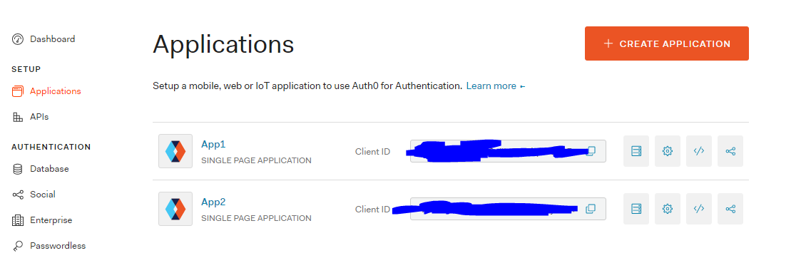
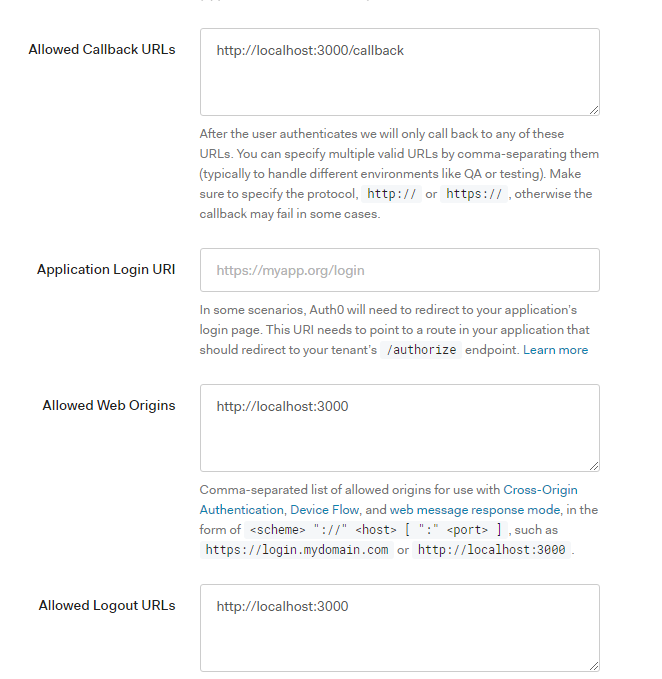
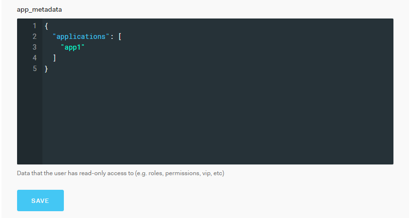

# Auth0 "Invite Only" Application Rule Sample
- Example of 2 Apps sharing the same user database but users can only access apps they are invited to.
- Apps are from Auth0

## Result
- You should only be able to login to App1. Trying to login to App2 will error and the console will show that you aren't invited to the app.

## Auth0 Setup
- Get a Auth0 account (free)
- Create 2 Applications in Auth0 dashboard
    
    - **Note**: Adjust links accordingly in Auth0. This repo assumes:
        - App1 = localhost:3000
        - App2 = localhost:4300

         Example for app1
        

- Create a rule/rules with this link
>https://manage.auth0.com/dashboard/us/{yourTenantName}/rules
- Add this rule (name it however you like)
    ```
    function (user, context, callback) {

    if (context.clientName === 'App1') {
        if (!user.app_metadata.applications.includes('app1')){
            return callback(
                new UnauthorizedError('You are not invited in this app'));
        }
    }

    callback(null, user, context);
    }
    ```
**Note**: We are checking user.app_metadata.applications

- Create a user
- In the user profile, you can scroll down and see
    - user_metadata (users can read and write)
    - app_metadata (users can only read)

- Add the value of applications["app1"] in app_metadata for the user
    

------
## App setup

- Add a config.json inside each App with this format.
```
{
    "clientID": "",
    "domain": ""
}
```
- 2 terminals and just npm install && npm run start on each App

